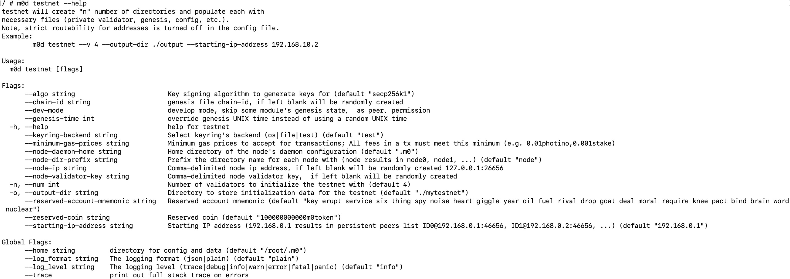

# 进阶使用

## 部署网络
- 定义区块链，收集信息
  - 验证人个数（--num）
  - 提供验证人列表信息，如助记词(--node-validator-key)、IP:PORT(--node-ip)等
  - 提供链相关信息， 如链ID(--chain-id)、创世块时间(--genesis-time)等
  - 提供创世账户(--reserved-account-mnemonic)、创世资产(--reserved-coin)等
  - 提供节点列表 ID@host:port,ID@host:port,ID@host:port
- 生成初始区块链节点启动文件（尤其是链创世块文件）
```shell script
m0d testnet --help
```


在mytestnet目录(--output-dir)生成各个节点的配置文件，节点配置文件中含链定义创世块文件。加入网络的节点，必须使用该创世块文件genesis.json。

- 启动初始区块链节点
```shell script
# 生成节点配置
m0d init moniker

# 替换 genesis.json
cp genesis.json ~/.m0/config/genesis.json

# 启动节点
m0d start --p2p.persistent_peers=ID@host:port,ID@host:port,ID@host:port
```

## 账户管理

M0提供了本地的私钥管理功能，支持创建、导入等。
```shell script
# 私钥管理
m0d keys --help
```
- 创建用户
```shell script
# 创建私钥,别名为bob
m0d keys add bob
```
- 导入账户
```shell script
# 导入私钥,别名为bob
m0d keys add bob --recover
```
## 模块列表

M0交易即模块内一种操作行为，所以了解支持的交易类型，需了解各个模块的功能及可操作行为。
```shell script
# 发送交易, m0d tx 模块名 操作行为
m0d tx --help

# 查询状态, m0d query 模块名 查询行为
m0d query --help
```

- [资产管理模块](../spec/utxo.md)
- [合约管理模块](../spec/wasm.md)
- [验证人管理模块](../spec/validator.md)
- [节点管理模块](../spec/peer.md) 
- [公钥基础设施模块](../spec/pki.md) 
- [账户权限模块](../spec/permission.md) 
- [隐私数据模块](../spec/storage.md) 