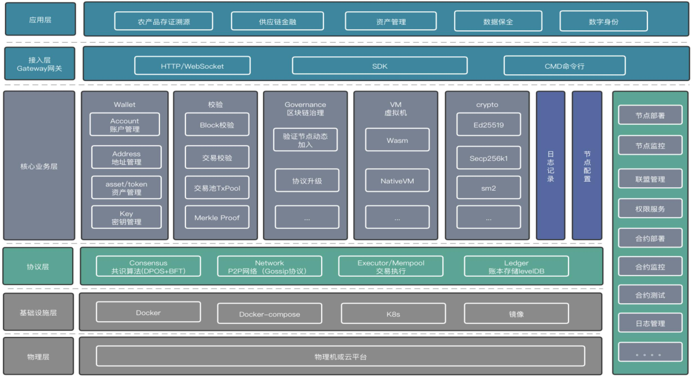

## 简介
M0是北京磁云唐泉金服自主研发的区块链框架，是构建联盟链/公有链网络的底层解决方案，以高性能共识、高安全可用的加密算法、高效的智能合约、隐私数据、跨链等核心技术，实现未来价值传输网络各类关键技术，构建全球价值互联网，为各类价值传输应用提供基础网络。其优点有自主可控、模块化功能扩展等，能够快速匹配各种场景落地案例，完善平台功能，打造不分行业的区块链框架。
- 提供了一站式开发工具集，不限于命令行接口、SDK接口、钱包、浏览器、基于事件的关键行为监管审计、业务(存证、电子合同、溯源、身份标识、事件驱动等)中间件等
- 高性能的共识算法，POA+BFT相结合的共识算法，提高共识算法性能，极大提高平台吞吐量。
- 高效的智能合约wasm引擎，利用读写集实现并行执行和验证；支持执行消耗资源，避免恶意攻击；支持丰富的开发语言比如go、C/C++、Java等。
- 易扩展的模块化架构，由模块定义状态子集，并包含其自己的消息/交易处理器，平台负责将每条消息路由到其各自归属的模块。模块间也可以相互进行组合。
- 支持国际标准和国家标准的密码学算法，通信信道启用传输层加密技术，同时支持硬件和软件的密钥证书管理。
- 完善的链上治理制度，节点管理、证书管理、验证人管理等。
- 支持多种存储引擎，goleveldb、cleveldb、多盘存储、云存储等。
- 完善的数据隐私保护，多种密码技术的身份隐私及可信硬件的存储计算隐私。
- 支持同构异构跨链通信，IBC (Inter-Blockchain Communication Protocol) 是通用跨链信息传输协议。在保证各个链自治，处理交易速度的同时，IBC 让信息和资产跨链更加的去中心化，安全和便捷。IBC 只负责数据安全的传输，对于数据的序列化则需要建立在区块链上的应用进行处理。需要运行一个 Relayer 来进行消息的传递。Relayer 会持续检查链的状态，并在另一条链上创建包含对应消息的交易。

简而言之，M0是一套区块链解决方案，采用经典的UTXO记账模式，并且支持丰富的智能合约开发语言，交易处理支持并发执行，拥有完善的账号与权限体系，采用POA+BFT作为共识算法，交易处理速度可达到3万TPS。