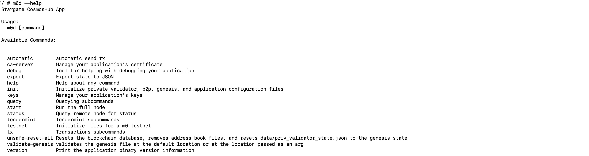

# 快速入门

本章节将指导您获取M0的代码并部署一个基础的可用环境，还会展示一些基本操作

## 环境部署

### 准备环境
M0主要由Golang开发，需要首先准备编译运行的环境
- 安装go语言编译环境，版本为1.16或更高。[下载地址](https://golang.org/dl/)
- 安装git。[下载地址](https://git-scm.com/download)

### 编译

- 使用git下载源码到本地
```shell script
git clone https://github.com/liubaninc/m0.git
```

- 源码编译
```shell script
cd src/github.com/liubaninc/m0
make
```
build目录生成可执行文件

- 源码安装
```shell script
cd src/github.com/liubaninc/m0
make
```
$GOPATH/bin目录生成可执行文件

- 编译镜像
```shell script
cd src/github.com/liubaninc/m0
make m0-image
```
构建ciyuntangquan/m0:latest镜像文件

## 搭建网络

使用docker-compose工具部署测试网络
> 本地容器化运行的示例，实际场景中可以用卷的方式挂载并覆盖配置。

- 初始化网络 生成docker-compose容器服务yaml文件
```shell script
# 默认创建testnetA网络，1个种子节点、4个验证节点、2个数据节点（含同步数据服务、钱包、浏览器）
./samples/net_init.sh
```
-启动网络 启动docker-compose容器服务yaml文件
```shell script
# 默认启动testnetA网络，1个种子节点、4个验证节点、2个数据节点（含同步数据服务、钱包、浏览器）
./samples/net_up.sh
```

测试网络搭建完成，开启您的区块链之旅！

查看网络节点详情
```shell script
docker ps -a
```
获知浏览器8088、钱包8086映射在本地的端口，可以访问web界面。

## 基本操作


常用二级子命令简介（--help 获取更多详情信息）
- status 查询当前节点状态。
- testnet 初始化网络配置，尤其是创世块文件。
- keys 本地账户私钥管理
- tx 发送交易
- query 区块链数据、世界状态查询

### 确认节点状态

```shell script
m0d status
```

#### 导入账户
```shell script
# 账户名 alice
echo "key erupt service six thing spy noise heart giggle year oil fuel rival drop goat deal moral require knee pact bind brain word nuclear" | m0d keys add alice --recover
```

#### 新建账户
```shell script
# 账户名 bob
m0d keys add bob
```

#### 查询余额
```shell script
# 账户名alice地址的余额
m0d query bank balances $(m0d keys show alice -a)

# 账户名bob地址的余额
m0d query bank balances $(m0d keys show bob -a)
```

#### 转账交易
```shell script
# alice 转账给 bob
m0d tx utxo send $(m0d keys show bob -a) 10m0token --from alice --chain-id=testnetA --broadcast-mode block -y
```

#### 查询交易

```shell script
m0d query tx 54086047504F5A7536EEC241ADDDE09377CD1882ECE70EA6C6D21CA326F2D85A
```

#### 查询区块

```shell script
# 查询高度为5的区块，无指定高度为最新区块
m0d query block 5
```